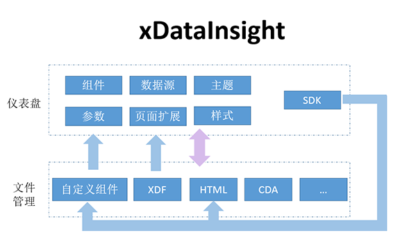

<h1 id="概述">概述</h1>

&ensp; &ensp;&ensp;开放Dashboard SDK，包括SDK包、API、开发文档等内容，用户可以基于此SDK二次开发出自己需要的组件或页面。提供界面下载SDK的入口，有权限的用户可以进入下载，基于SDK开发的结果，可以上传到xDataInsight进行管理和运行。

&ensp; &ensp;&ensp;仪表盘、组件、SDK等之间的关系，如下图所示：

