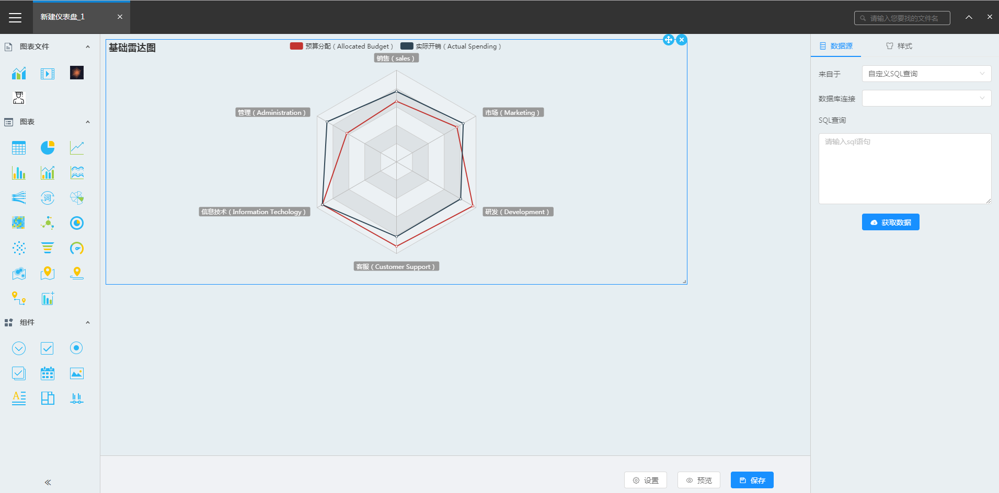
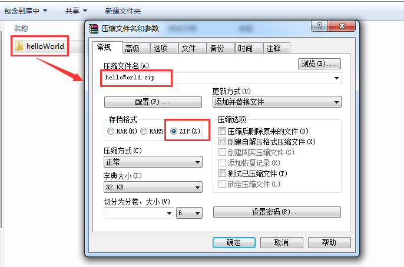
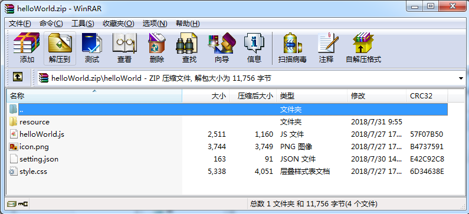
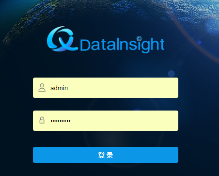
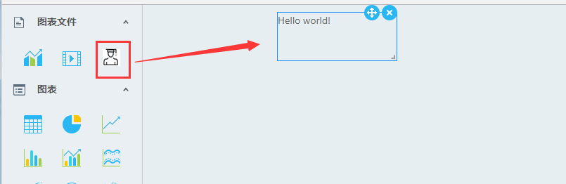
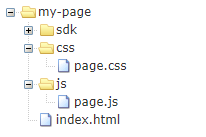

<h1 id="概述">概述</h1>

&ensp; &ensp;&ensp;开放Dashboard SDK，包括SDK包、API、开发文档等内容，用户可以基于此SDK二次开发出自己需要的组件或页面。提供界面下载SDK的入口，有权限的用户可以进入下载，基于SDK开发的结果，可以上传到xDataInsight进行管理和运行。

&ensp; &ensp;&ensp;仪表盘、组件、SDK等之间的关系，如下图所示：


<h1 id="开发环境搭建">开发环境搭建</h1>

&ensp; &ensp;&ensp;Dashboard提供SDK包，通过SDK包提供的组件和API，用户可以快速构建页面或者应用。

+ **步骤1 获取SDK包，下载SDK包至本地。**

+ **步骤2 将SDK包解压，解压后结构如下：**

    ├─ sdk

    ├─   ├─ resource

    ├─   ├─ dashboard.core.js

    ├─   ├─ styles.css

    resource：SDK包资源文件夹，包含图片、字体文件等。

    dashboard.core.js：SDK包主文件。

    styles.css：SDK包样式文件。

+ **步骤3 在项目中引入js和css文件，如下：**

````html
<!DOCTYPE html>
<html>
<head>
    <meta charset="UTF-8">
    <meta name="viewport" content="width=device-width, initial-scale=1.0">
    <meta http-equiv="X-UA-Compatible" content="IE=edge">
    <title>my app</title>
    <link rel="stylesheet" href="./sdk/styles.css">
</head>
<body>
    <div id="app"></div>
    <script src="./sdk/dashboard.core.js"></script>
    <script>
    //code...
    </script>
</body>
</html>
````


+ **步骤4 通过SDK提供的组件和API开发页面。**

+ **步骤5 开发环境构建完成。**

<h1 id="自定义组件开发规范">自定义组件开发规范</h1>


&ensp; &ensp;&ensp;用户可以开发自定义组件，上传到xDataInsight平台文件系统对应目录中。Dashboard初始化时会自动读取对应文件目录中的所有自定义组件包，自定义组件加载成功后，用户可以在仪表盘中使用这些组件构建和配置页面。

&ensp; &ensp;&ensp;组件开发需要遵循自定义组件开发规范，否则无法被平台识别和加载。

<h2 id="目录结构">目录结构</h2>

├─ helloWorld

├─   ├─ resource

├─   ├─ setting.json

├─   ├─ helloWorld.js

├─   ├─ style.css

├─   ├─ icon.png

>说明：

>如果是在node环境下开发组件，打包后需保持以上目录结构。

<h2 id="文件/文件夹说明">文件/文件夹说明：</h2>

+ **helloWorld文件夹**

    组件主文件夹。文件夹名称要求用组件名称命名，且该名称不能重复。

+ **resource文件夹**

    组件包的资源文件夹目录，可以放图片、字体等资源。

+ **setting.json文件**

    组件说明：文件。

````javascript
{
    "type": "helloWorld",
    "name": "Hello World",
    "version": "1.0.0",
    "icon": {
        "type": "file",
        "fileName": "icon.png"
    }
}
````

+ **helloWorld.js文件**

    组件主js文件，包含组件类定义、配置信息声明和组件注册。

````javascript
/**
* 组件主文件
* author：XXX
* create time:
*/
(function(){
    //从Dashboard中获取组件基类
    var widgetBase = window.Dashboard.widgetBase;

    //定义组件类
    class HelloWorld extends widgetBase{
        constructor(htmlObj, cfg){
            super(htmlObj, cfg)
        }
    }

    //配置信息声明
    var config = {};

    var options = {
        widgetClass:widget,
        widgetConfig:config
    }

    //注册组件
    window.Dashboard.register("helloWorld",options,true);
})();
````
>说明：

>如果文件中用到ES6语法，需要通过 [babel](https://www.babeljs.cn/) 等工具对内容进行转换。

+ **style.css文件**

    组件样式文件。

>说明：

>自定义组件样式选择器需要遵循命名方式cunstom-<name>-[XXX]。比如组件如果为helloWorld，其css选择器可以为： cunstom-helloWorld-XXX 、cunstom-helloWorld ul等。

+ **icon.png文件**

    组件图标文件，建议尺寸大小为26px X 26px。


<h2 id="组件生命周期及钩子函数">组件生命周期及钩子函数</h2>

&ensp; &ensp; &ensp;组件生命周期及钩子函数，如下图所示：


<h1 id="API">API</h1>

<h2 id="框架API">框架API</h2>

<br/>

### [属性](#)

<br/>

#### version | 【 String 】

dashboard版本

<br/>

#### util | 【 Object 】 

平台提供的工具函数集合。

<br/>

#### lib | 【 Object 】 

平台提供的库类。

<br/>

#### lib.$ | 【 Object 】 

jQuery库，高效精简，功能丰富的JavaScript工具库。

<br/>

#### lib._ | 【 Object 】 

underscore库，是一个JavaScript使用库，提供一整套函数式编程的实用功能。

<br/>

#### widgetBaseClass | 【 Object 】 

组件基类，所有组件实现需继承此基类。

<br/>

### [方法](#)

<br/>

#### bootstrap(cb)

SDK引导程序。

+ **参数**

    cb | Function 回调函数

+ **返回值**

    【Promise】

<br/>

#### register(name,options,isCustom)

注册组件。

+ **参数**

    name | 【 String 】

    组件类型

    options | 【Object】

    参数对象 {widgetClass,widgetConfig}

    isCustom | 【Boolean】

    是否自定义组件

+ **返回值**

/

<br/>

#### add(options)

添加组件

+ **参数**

+ options | 【Object】

    参数对象

    options.htmlObj | 【DOM Object】 

    组件添加的位置

    options.cfg | 【Object 】

    组件的config对象

+ **返回值**

    【Object】组件实例对象

<br/>

#### remove(id)

移除组件

+ **参数**

    id | 【 String 】

    组件ID

+ **返回值**

/

<h2 id="组件基类API">组件基类API</h2>

<br/>

### [属性](#)

<br/>

#### allowQueryErrorCount | 【 Number 】 

数据源刷新，最大允许错误次数。

<br/>

#### cfg | 【 Object 】

组件配置

<br/>

#### cfg.bigandsmall | 【 Boolean 】

是否支持放大/缩小

<br/>

#### cfg.chartBtns | 【 Boolean 】

（图表属性）是否显示图表的功能键

<br/>

#### cfg.chartDefinition | 【 Object 】

关于图表的定义

<br/>

#### cfg.chartDefinition.data | 【 Object 】

数据

<br/>

#### cfg.chartDefinition.defaultOption | 【 Object 】

(图表属性)默认option

<br/>

#### cfg.chartDefinition.hasFreshQuery | 【 Boolean 】

(组件属性)是否刷新数据源

<br/>

#### cfg.chartDefinition.freshQuery | 【 Boolean 】

(图表属性)是否刷新数据源

<br/>

#### cfg.chartDefinition.id | 【 String 】

组件配置id

<br/>

#### cfg.chartDefinition.inject | 【 Object 】

注入代码

<br/>

#### cfg.chartDefinition.option | 【 Object 】

配置option

<br/>

#### cfg.chartDefinition.query | 【 String 】

数据源

<br/>

#### cfg.chartDefinition.queryid | 【 String 】

数据源id

<br/>

#### cfg.chartDefinition.queryname | 【 String 】

数据源名称

<br/>

#### cfg.executeAtStart | 【 Boolean 】

执行时启动

<br/>

#### cfg.id | 【 String 】

组件id

<br/>

#### cfg.layout | 【 Object 】

组件的布局

<br/>

#### cfg.listeners | 【 Object 】

被监听的参数

<br/>

#### cfg.name | 【 String 】

组件名称

<br/>

#### cfg.type | 【 String 】

组件类型

<br/>

#### echartsDom | 【 Object 】

echart实例

<br/>

#### htmlObj | 【 DOM Object 】

容器

<br/>

#### id | 【 String 】

组件id

<br/>

#### isEditMode | 【 Boolean 】

是否处于编辑模式

<br/>

#### isFirstQuery | 【 Number 】

数据源获取次数。

<br/>

#### loader | 【 Object 】

加载图，被创建后有hide与show两种状态

<br/>

#### minFreshPeriod | 【 Number 】

数据源刷新最小时间，单位：秒

<br/>

#### oldTime | 【 Number 】

上一次组件刷新时间

<br/>

#### queryErrorCount | 【 Number 】

数据源错误次数。

<br/>

#### queryState | 【 String 】

数据源获取状态。

<br/>

#### rawhtmlObj | 【 DOM Object 】

容器

<br/>

#### resizeState | 【 string 】

组件实例刷新状态

<br/>

#### rootDom | 【 DOM Object 】

容器

<br/>

#### tickIsStop | 【 Boolean 】

是否停止刷新。

<br/>

### [方法](#)

<br/>

#### setContainerDom()

在htmlObj下设置一个新的div 作为组件容器。

+ **参数**

/

+ **返回值**

/

<br/>

#### createLoader()

创建加载图，返回对它状态控制的对象。

+ **参数**

/

+ **返回值**

【Object】

<br/>

#### setParameter(value)

具有parameter属性的组件中，当值变化时，触发该方法，改变globalParam中相应的值。

+ **参数**

    value | 【 * 】

    属性值

+ **返回值**

【Object】

<br/>

#### getParameter(parameterid)

获取globalParam中该属性的值。

+ **参数**

    parameterid | 【 String 】

    属性id

+ **返回值**

【*】

<br/>

#### paramListenedChange(obj1,obj2)

监听参数变化，通知组件接口

+ **参数**

    obj1 | 【 Object 】

    listeners 中 监听有改变的参数

    obj2 | 【 Object 】

    所有改变的参数

+ **返回值**

/

<br/>

#### setFreshPeriod(time)

设置数据源刷新时间。

+ **参数**

    time | 【 Number 】

    刷新时间

+ **返回值**

/

<br/>

#### setTickState(state)

设置数据源刷新状态。

+ **参数**

    state | 【 Boolean 】

    刷新状态

+ **返回值**

/

<br/>

#### freshTick()

刷新数据源

+ **参数**

/

+ **返回值**

/

<br/>

#### doQuery(callback,initor)

查询数据

+ **参数**

    callback | 【 Function 】

    回调函数

    initor | 【 * 】

    触发原因

+ **返回值**

/

<br/>

#### queryFetched(data)

数据获取回来的钩子，子类继承这个钩子

+ **参数**

    data | 【 * 】

    数据

+ **返回值**

/

<br/>

#### paramChanged(obj)

参数改变后的钩子，子类继承这个钩子

+ **参数**

    obj | 【 object 】

    参数对象

+ **返回值**

/

<br/>

#### widgetWillCreated(cfg)

组件创建前触发该函数，子类继承这个钩子

+ **参数**

    cfg | 【 Object 】

    组件配置

+ **返回值**

/

<br/>

#### widgetDidCreated(cfg)

组件创建前触发该函数，子类继承这个钩子

+ **参数**

    cfg | 【 Object 】

    组件配置

+ **返回值**

/

<br/>

#### preUpdate(nextCfg)

组件创建前触发该函数，子类继承这个钩子

+ **参数**

    nextCfg | 【 Object 】

    变化后的组件配置

+ **返回值**

/

<br/>

#### update(nextCfg)

更新组件

+ **参数**

    nextCfg | 【 Object 】

    变化后的组件配置

+ **返回值**

/

<br/>

#### postUpdate(nextCfg)

组件更新后触发该函数，子类继承这个钩子

+ **参数**

    nextCfg | 【 Object 】

    变化后的组件配置

+ **返回值**

/

<br/>

#### resize()

window resize 触发该函数

+ **参数**

/

+ **返回值**

/

<br/>

#### draw()

绘制组件

+ **参数**

/

+ **返回值**

/

<br/>

#### handleData()

处理数据

+ **参数**

/

+ **返回值**

/

<br/>

#### destroy()

销毁组件

+ **参数**

/

+ **返回值**

/

<br/>

#### getCfg()

获取配置

+ **参数**

/

+ **返回值**

【Object】组件配置对象

<br/>

<h1 id="组件封装示例">组件封装示例</h1>

&ensp; &ensp; &ensp;描述自定义组件开发步骤及过程，以组件helloWorld为例。

&ensp; &ensp; &ensp;该组件可以显示为一段文字内容，具有3个组件属性：文本内容、对齐方式和字体颜色。

<h2 id="开始">开始</h2>

+ **步骤1	新建文件夹helloWorld。**


+ **步骤2	在helloWorld文件夹下分别创建resource文件夹，以及文件setting.json、helloWorld.js、style.css，并将组件图标文件命名为icon.png放置在该文件夹下，如图：**

+ **步骤3	初始化文件内容：**

#### setting.json：

````javascript
{
    "type": "helloWorld",
    "name": "Hello World",
    "version": "1.0.0",
    "icon": {
        "type": "file",
        "fileName": "icon.png"
    }
}
````

#### style.css：

````css
/* 
* 组件样式文件
* style.css
*/
````

#### hellWorld.js：

````javascript
/**
* 组件主文件 hellWorld.js
* author：XXX
* create time:2018/7/30
*/
(function(){
    //从Dashboard中获取组件基类
    var widgetBase = window.Dashboard.widgetBase;
    //从Dashboard中获取jquery类库，并缓存
    var $ = window.Dashboard.lib.$;

    //定义组件类
    class HelloWorld extends widgetBase{
        constructor(htmlObj, cfg){
            super(htmlObj, cfg)
        }

        doQuery(cfg){
            super.doQuery(cfg);
        }

        queryFetched(data){
            super.queryFetched(data);
        }

        paramChanged(obj1){
            super.paramChanged(cfg);
        }   

        widgetWillCreated(cfg){
            super.widgetWillCreated(cfg);
        }

        widgetDidCreated(cfg){
            super.widgetDidCreated(cfg);
        }

        preUpdate(nextCfg){
            super.preUpdate(nextCfg);
        }

        postUpdate(nextCfg){
            super.postUpdate(nextCfg);
        }

        resize(){
            super.resize();
        }

        update(nextCfg){
            super.update(nextCfg);
        }

        draw(nextCfg){
            super.draw(nextCfg);
        }

        destroy(){
            super.destroy();
        }
    }

    //定义组件配置对象
    var config = {};

    var options = {
        widgetClass:HelloWorld,
        widgetConfig:config
    }

    //注册组件helloword
    window.Dashboard.register('helloWorld',options,true);
})();
````

<h2 id="构建组件配置项">构建组件配置项</h2>

补充helloWorld.js中config定义部分：

````javascript
/**
* 组件配置文件 
*/
var config = {
    /**
    * base          {Object}   基础配置
    * base.type     {String}   组件名称
    * base.group    {String}   组件所属分组
    * base.name     {String}   组件显示名称
    * base.version  {String}   组件版本号
    */
    base:{
        type:'helloWorld',
        name:'Hello World',
        group:'100'
    },
    /**
    * panel {Object} 组件配置面板配置
    * panel.dataSource    {Object}     数据源配置
    * panel.style         {Object}     样式配置
    */
    panel:{
        dataSource:{
            name: "数据源",
            //支持配置的数据源类型
            typeList: ['sql']
        },
        style:{
            name:'样式',
            /**
            * 面板组件配置
            */
            panelcfg:dataForPanel=>([
                {
                    name:'标题',
                    value:[
                        {
                            cname: "内容",
                            name: "text",
                            widget: "XInput",
                            disable: false,
                            visible: true
                        }
                    ]
                },
                {
                    name:'其他',
                    value:[
                        {
                            type: "string",
                            cname: "对齐方式",
                            name: "algin",
                            widget: "XRadio",
                            disable: false,
                            visible: true,
                            option: [
                                { name: "左", value: "left" },
                                { name: "中", value: "center" },
                                { name: "右", value: "right" }
                            ]
                        },
                        {
                            type: "string",
                            cname: "文本颜色",
                            name: "color",
                            widget: "XColorPicker",
                            disable: false,
                            visible: true,
                            option: [{ type: "normal" }]
                        }
                    ]
                }
            ]),
            //面板组件
            panelcmp: null
        }
    },
    /**
    * cfg {Function} 组件配置，组件初始化及主题切换时调用，生成组件属性
    * @param {Object} theme 主题对应属性
    * @return {Object} 基于主题生成的组件属性对象
    */
    cfg:(theme)=>{
        return {
            type: "helloWorld",
            name: "helloWorld",
            priority: 5,
            parameter: "",
            bigandsmall: true,
            executeAtStart: true,
            listeners: [],
            layout: {
                i: "",
                x: 0,
                y: 0,
                w: 3,
                h: 2,
                minW: 1,
                minH: 1,
                maxW: 12,
                moved: true
            },
            chartDefinition: {
                queryid: "",
                queryname: "",
                query: {
                    type: "",
                    param: {},
                    statement: "",
                    query: "",
                    jndi: ""
                },
                data: {},
                option: {
                    text:'Hello world!',
                    algin:'left',
                    color:'#666'
                },
                inject: {}
            }
        }
    },
    /**
    * 数据绑定配置配置信息
    * databind.dataset 数据集的绑定相关配置信息,支持如下属性
    * show {Boolean} 组件图标是否展示 默认true 
    * switch {Boolean} 是否可以切换至其他组件 默认true
    * iconClass {String} 组件图标如果展示，组件图标对应类名。对应类名需在样式文件中实现。规格为26X26。
    * cells {Array} 组件支持的字段框集合
    * cells[n] {Object} 单个字段框配置对象
    * cells[n].collectType: 0 不可汇总 1 必须汇总 2 可汇总
    * cells[n].min 格子最少字段数量
    * cells[n].max 格子最多字段数量
    * cells[n].valid(len,lenArr) 格子内字段情况验证 len{Number}: 当前格子包含的字段数量 lenArr{Aray}: 当前格子组的字段数集合
    * allowFieldTypes {Array} 格子可接收字段的类型集合，如果不设置该字段则表示该格子不限制拖入字段的类型
    */
    databind:{
        dataset:{
            show: false,
            switch: false,
            iconClass: "layout-helloWorld",
            cells: [
                {
                    title: "字段",
                    valueKey: "datas",
                    max:1,
                    min:1,
                    collectType: {
                        defaultValue: 0,
                        selectValue: 2
                    }
                }
            ]
        }
    }
};
````

>说明：

>1、base中配置组件基本信息，需和helloWorld中对应，其中group为分组信息，仪表盘组件分为三个组：图表文件、图表和组件，其groupId分别为100、101、102，请根据实际需要配置。

>2、panel中配置右侧面板对应配置项。datSource为数据源配置项。style为样式配置项，panelcfg中配置哪些组件属性可以在配置面板-样式中配置，这里示例组件列举了三个组件属性：1、文本内容(text) 2、对齐方式(algin) 3、字体颜色(color)。

>3、cfg类型为Function，当前主题样式对象将被作为参数传入，该函数在组件初始化或主题切换的时候会被调用，其返回值将作为组件初始化cfg。组件cfg对象结构参见API章节。

>4、panelcfg中每项配置中widget指配置项需要用何种类型配置组件展示，系统内置配置组件如下表所示：

| 组件名称 | 描述 | option配置示例 |
| :------| :------ | :------ |
| XColorPicker | 颜色选择器 | [{ type: "listColor" }] |
| XIconPicker | 图标选择 | [{icon: bike, value: 'fa fa-bicycle', name: '自行车'},…] |
| XInput | 输入框 | null |
| XRadio | 单选 | [{name:'上',value:'top'},...] |
| XSelect | 下拉选择 | [{name:'上',value:'top'},...] |
| XSlider | 滑块选择 | [{ maxRange: 50, minRange: 1, tipFormatter: "%" }] |
| XSwitch | 开关 | null |
| XRadioGroup | 单选组 | [{name:'上',value:'top'},...] |
| XRadioInput | 带自定义单选 | [{name:'关',value:'auto',defaultValue: 'auto'},{name:'开',name2: '',value:0,defaultValue: 10}] |
| XDate | 日期选择 | null |
| XCodeEditor | 代码编辑 | [{type: 'javascript'}] |
| XRadioGroupInput | 带自定义单选组 | [{"name":"无","value":"auto","defaultValue":"auto"},{"name":"平均","value":"average","defaultValue":"average"},{"name":"定值","name2":"","value":0,"defaultValue":0}] |
| XFileSrc | 文件选择 | {"src":"/xDataInsight/api/repo/files/tree?filter=*.jpg|*.png|*.gif|*.bmp&_=1389042244770","type":"image"} |

<h2 id="封装组件类">封装组件类</h2>


组件继承至基类。

在初始化时候可以在widgetDidCreated中对组件自身DOM结构进行构建和缓存：

````javascript
widgetDidCreated(cfg){
    super.widgetDidCreated(cfg);
    this.$dom = $(
        '<div class="custom-helloword">\
            <div class="custom-helloword-title"></div>\
            <div class="custom-helloword-content"></div>\
        </div>'
    )
    this.$dom.appendTo(this.htmlObj);
    this.$title = $('.custom-helloword-title',this.$dom);
    this.$content = $('.custom-helloword-content',this.$dom);
}
````

当组件属性值变化时，我们可以在draw方法中对变化的属性值做出相应：

````javascript
draw(nextCfg){
    super.draw(nextCfg);
    if(nextCfg){
        var option;
        var data;

        if(nextCfg.option){
            option = nextCfg.option
        }else if(nextCfg.chartDefinition && nextCfg.chartDefinition.option){
            option = nextCfg.chartDefinition.option
        }

        if(nextCfg.data){
            data = nextCfg.data;
        }else if(nextCfg.chartDefinition && nextCfg.chartDefinition.data){
            data = nextCfg.chartDefinition.data;
        }

        if(option){
            for(let key in option){
                this.option(key,option[key]);
            }
        }

        if(data){
            this.option('data',data);
        }
    }
}
````

其中option方法需在组件类中新增，内容如下：

````javascript
option(key,value){
    switch(key){
        case 'text':
        this.$title.text(value);
        break;
        case 'color':
        $(this.htmlObj).css('color',value);
        break;
        case 'algin':
        $(this.htmlObj).css('text-align',value);
        break;
        case 'data':
        this._handleData();
        break;
    }
}
````

其中_handleData为数据处理部分，方法需在组件类中新增，内容如下：
````javascript
_handleData(){
    var data = this.cfg.chartDefinition.data;
    var dataLen = 0;

    if(data && data.resultset){
        dataLen = data.resultset.length;
    }
    
    this.$content.text('共查询了'+ dataLen +'条数据');
}
````

完整的helloWorld.js内容如下：
````javascript
/**
* 组件主文件 hellWorld.js
* author：XXX
* create time:2018/7/30
*/
(function(){
    //从Dashboard中获取组件基类
    var widgetBase = window.Dashboard.widgetBase;
    //从Dashboard中获取jquery类库，并缓存
    var $ = window.Dashboard.lib.$;

    //定义组件类
    class HelloWorld extends widgetBase{
        constructor(htmlObj, cfg){
            super(htmlObj, cfg);
        }

        doQuery(cfg){
            super.doQuery(cfg);
        }

        queryFetched(data){
            super.queryFetched(data);
        }

        paramChanged(obj1){
            super.paramChanged(cfg);
        }   

        widgetWillCreated(cfg){
            super.widgetWillCreated(cfg);
        }

        widgetDidCreated(cfg){
            super.widgetDidCreated(cfg);
            this.$dom = $(
                '<div class="custom-helloword">\
                    <div class="custom-helloword-title"></div>\
                    <div class="custom-helloword-content"></div>\
                </div>'
            )
            this.$dom.appendTo(this.htmlObj);
            this.$title = $('.custom-helloword-title',this.$dom);
            this.$content = $('.custom-helloword-content',this.$dom);
        }

        preUpdate(nextCfg){
            super.preUpdate(nextCfg);
        }

        postUpdate(nextCfg){
            super.postUpdate(nextCfg);
        }

        resize(){
            super.resize();
        }

        update(nextCfg){
            super.update(nextCfg);

            //数据处理
            if( nextCfg.data ){
                //code...
                this._handleData();
            }
        }

        _handleData(){
            var data = this.cfg.chartDefinition.data;
            var dataLen = 0;

            if(data && data.resultset){
                dataLen = data.resultset.length;
            }
            
            this.$content.text('共查询了'+ dataLen +'条数据');
        }

        draw(nextCfg){
            super.draw(nextCfg);
            if(nextCfg){
                var option;
                var data;

                if(nextCfg.option){
                    option = nextCfg.option
                }else if(nextCfg.chartDefinition && nextCfg.chartDefinition.option){
                    option = nextCfg.chartDefinition.option
                }

                if(nextCfg.data){
                    data = nextCfg.data;
                }else if(nextCfg.chartDefinition && nextCfg.chartDefinition.data){
                    data = nextCfg.chartDefinition.data;
                }

                if(option){
                    for(let key in option){
                        this.option(key,option[key]);
                    }
                }

                if(data){
                    this.option('data',data);
                }
            }
        }

        option(key,value){
            switch(key){
                case 'text':
                this.$title.text(value);
                break;
                case 'color':
                $(this.htmlObj).css('color',value);
                break;
                case 'algin':
                $(this.htmlObj).css('text-align',value);
                break;
                case 'data':
                this._handleData();
                break;
            }
        }

        destroy(){
            super.destroy();
        }
    }

    /**
    * 组件配置文件 
    */
    const config = {
        /**
        * base          {Object}   基础配置
        * base.type     {String}   组件名称
        * base.group    {String}   组件所属分组
        * base.name     {String}   组件显示名称
        * base.version  {String}   组件版本号
        */
        base:{
            type:'helloWorld',
            name:'Hello World',
            group:'100'
        },
        /**
        * panel {Object} 组件配置面板配置
        * panel.dataSource    {Object}     数据源配置
        * panel.style         {Object}     样式配置
        */
        panel:{
            dataSource:{
                name: "数据源",
                //支持配置的数据源类型
                typeList: ['sql']
            },
            style:{
                name:'样式',
                /**
                * 面板组件配置
                */
                panelcfg:dataForPanel=>([
                    {
                        name:'标题',
                        value:[
                            {
                                cname: "内容",
                                name: "text",
                                widget: "XInput",
                                disable: false,
                                visible: true
                            }
                        ]
                    },
                    {
                        name:'其他',
                        value:[
                            {
                                type: "string",
                                cname: "对齐方式",
                                name: "algin",
                                widget: "XRadio",
                                disable: false,
                                visible: true,
                                option: [
                                    { name: "左", value: "left" },
                                    { name: "中", value: "center" },
                                    { name: "右", value: "right" }
                                ]
                            },
                            {
                                type: "string",
                                cname: "文本颜色",
                                name: "color",
                                widget: "XColorPicker",
                                disable: false,
                                visible: true,
                                option: [{ type: "normal" }]
                            }
                        ]
                    }
                ]),
                //面板组件
                panelcmp: null
            }
        },
        /**
        * cfg {Function} 组件配置，组件初始化及主题切换时调用，生成组件属性
        * @param {Object} theme 主题对应属性
        * @return {Object} 基于主题生成的组件属性对象
        */
        cfg:(theme)=>{
            return {
                type: "helloWorld",
                name: "helloWorld",
                priority: 5,
                parameter: "",
                bigandsmall: true,
                executeAtStart: true,
                listeners: [],
                layout: {
                    i: "",
                    x: 0,
                    y: 0,
                    w: 3,
                    h: 2,
                    minW: 1,
                    minH: 1,
                    maxW: 12,
                    moved: true
                },
                chartDefinition: {
                    queryid: "",
                    queryname: "",
                    query: {
                        type: "",
                        param: {},
                        statement: "",
                        query: "",
                        jndi: ""
                    },
                    data: {},
                    option: {
                        text:'Hello world!',
                        algin:'left',
                        color:'#666'
                    },
                    inject: {}
                }
            }
        },
        /**
         * 数据绑定配置
         */
        databind:{
            dataset:{
                iconClass: "layout-helloWorld",
                cells: [
                    {
                        title: "字段",
                        valueKey: "datas",
                        max:1,
                        min:1,
                        collectType: {
                            defaultValue: 0,
                            selectValue: 2
                        }
                    }
                ]
            }
        }
    };

    var options = {
        widgetClass:HelloWorld,
        widgetConfig:config
    }

    //注册组件helloword
    window.Dashboard.register('helloWorld',options,true);
})();
````

至此，组件创建完成。

<h2 id="测试组件">测试组件</h2>

+ **步骤1 创建html文件，并引入SDK和组件主js文件及样式文件。如下：**

````html
<!DOCTYPE html>
<html>
<head>
    <meta charset="UTF-8">
    <meta name="viewport" content="width=device-width, initial-scale=1.0">
    <meta http-equiv="X-UA-Compatible" content="IE=edge">
    <title>test</title>
    <link rel="stylesheet" href="./sdk/styles.css">
    <link rel="stylesheet" href="./helloWorld/style.css">
    <style>
        #div1{
            width: 100px;
            height: 100px;
        }
    </style>
</head>
<body>
    <div id="div1"></div>
    <script src="./sdk/dashboard.core.js"></script>
    <script src="./helloWorld/helloWorld.js"></script>
    <script>
        var _Dashbord = window.Dashbord;
        var $ = _Dashbord.lib.$;
        _Dashbord.bootstrap().then(function(){
            var ins = _Dashbord.add({
                cfg:{
                    type:'helloWorld'
                },
                htmlObj:$('#div1')[0]
            })
        });
    </script>
</body>
</html>
````

+ **步骤2 浏览器中打开该html文件，观察组件是否正常展示。**


<h2 id="其他案例">其他案例</h2>

&ensp; &ensp;&ensp;上述通过简单实例阐述了自定义组件开发过程。按照自定义组件开发规范，我们可以按需扩充仪表盘既有组件。如没有的图表等。

+ **雷达图**



+ **3D Globe**


<h1 id="组件导入仪表盘">组件导入仪表盘</h1>

&ensp; &ensp;&ensp;自定义开发组件在本地开发、测试完成，可以将组件打包，上传到xDataInsight平台文件系统中。xDataInsight仪表盘在启动会自动读取指定目录下所有自定义组件，并加载。加载成功的组件可以和系统内置组件一样，被用作页面制作。

&ensp; &ensp;&ensp;本章节将详细讲述如何将开发完成的组件导入到仪表盘中。

<h2 id="组件包准备">组件包准备</h2>

+ **步骤1 进入组件包所在目录，选中组件包文件夹，点击鼠标右键-添加到压缩文件，存档格式为ZIP格式，压缩文件名保持不变。如下图所示。**



>说明：

>组件中css文件如果引用了resource中的图片或字体文件等资源，压缩组件包前需要对各资源路径进行替换[本地开发和测试不用替换]，将相对路径替换为如下格式：

>/xdatainsight/api/repos/:public:cde:components:helloWorld:resource:test.jpg/content 

>其中，helloWorld为组件名称 test.jpg为对应资源文件名称。

+ **步骤2 点击确定，等待系统压缩完成。**

+ **步骤3 压缩完成后会在同级目录生成对应的组件ZIP包。**

+ **步骤4 双击打卡组件包，检查确认组件包文件是否完整。**



<h2 id="组件包上传">组件包上传</h2>

+ **步骤1 登陆xDataInsight平台。**



+ **步骤2 登陆成功后，点击菜单进入文件管理系统。**


+ **步骤3 找到目录 共享目录 -> cde -> components。该目录默认为隐藏目录。**


>说明：

>1、共享目录 -> cde -> components 为自定义组件上传唯一指定目录，其他目录上传将不会被仪表盘所识别。

>2、如果无法看到该目录可以通过 用户中心 –> 用户设置 将隐藏文件显示。

>

+ **步骤4 点击components的操作按钮，选择弹出的操作菜单中的上传。**


+ **步骤5 选择已打好的组件ZIP包，点击完成将组件包上传至目标文件夹。**


+ **步骤6 上传成功后，可以看到目录树中会出现组件名称命名的文件夹。选择文件夹，右侧可以看到组件包里的所有文件。**


+ **步骤7 至此，组件包上传成功。**

<h2 id="验证组件">验证组件</h2>

+ **步骤1 点击菜单 分析与报表 -> 新建仪表盘 ，打开一个新的仪表盘页面。**


+ **步骤2 查看组件列表是否存在导入的组件。**


+ **步骤3 拖动导入的组件到画布区域，查看组件是否能正常展示，是否能在画布区内移动位置、修改尺寸、删除等。**



+ **步骤4 选中画布区内拖入的组件，查看右侧面板，面板是否能正常加载。**


+ **步骤5 选中【样式】页签对组件进行属性配置，查看配置是否生效。**


+ **步骤6 点击预览，查看组件是否正确展示。**


+ **步骤7 点击保存，选中要保存的目录，查看页面是否保存成功。**


+ **步骤8 进入文件管理，找到对应的保存目录，检查保存的文件的编辑、查看功能是否正常。**

+ **步骤9 组件导入仪表盘成功。**

>说明：

>导入成功的自定义组件，如果被使用，该组件不能随意删除，否则已配置的页面无法正常渲染该组件。

>组件可以被更新，重复以上组件的上传过程即可。如果该组件被使用，组件更新需要考虑向下兼容。

<h1 id="页面开发示例">页面开发示例</h1>

&ensp; &ensp; &ensp;描述如何通过SDK进行页面开发。SDK包内置仪表盘组件。其对应关系如下表所示：

| 组件名称 | Type | 组件名称 | Type |
| :----- | :----- | :----- | :----- |
| 下拉框 | select | 饼图 | chartPie |
| 自定义图表 | custom | 多维 | olap |
| 多选框 | checkbox | 单选框 | radio |
| 日期 | date | 文本 | text |
| 热力地图 | heatMap | 标记地图 | markerMap |
| 路线地图 | routeMap | 迁徙地图 | migrateMap |
| 视频 | video | 折线图 | chartLine |
| 柱状图 | chartBar | 折柱混合图 | chartMix |
| 容器 | container | 表格 | table |
| 多选下拉 | multiselect | 图片 | pictcomponent  |
| 指标点阵图 | chartDot | 河流图 | themeriver |
| 桑基图 | sankey | 南丁格尔玫瑰图 | chartRose |
| 热力图 | heatchart | 词云图 | chartWordCloud |
| 关系关联图 | graph | 嵌套环形图 | chartNestpie |
| 漏斗图 | chartFunnel | 油量图 | chartGauge |
| 动态数轴 | timeline | | |

<h2 id="创建页面工程">创建页面工程</h2>

+ **步骤1	 本地新建目录my-page，my-page下分别创建文件夹js、css、sdk及文件index.html，js和css文件夹下分别创建page.js和page.css，如下图：**



+ **步骤2	 将sdk包拷贝至sdk目录中。**

+ **步骤3	 页面工程创建完毕。**

>说明：

>页面工程具体结构根据实际可能不同，这里只是举例。

<h2 id="编写页面布局和逻辑">编写页面布局和逻辑</h2>

+ **步骤1 编辑index.html页面，引用各js和css文件。并根据业务需要编写页面布局。**

````html
/* index.html */
<html>
    <head>
        <meta charset="UTF-8">
        <meta http-equiv="X-UA-Compatible" content="IE=edge,chrome=1"> 
        <meta name="viewport" content="width=device-width, initial-scale=1.0">
        <title>test</title>
        <link rel="stylesheet" type="text/css" href="./sdk/styles.css">
        <link rel="stylesheet" type="text/css" href="./css/page.css">
    </head>
    <body>
        <div class="page-title">测试页面</div>
        <div class="page-charts">
            <div id="chart1" class="page-chart"></div>
            <div id="chart2" class="page-chart"></div>
            <div id="chart3" class="page-chart"></div>
            <div id="chart4" class="page-chart"></div>
            <div id="chart5" class="page-chart"></div>
        </div>
    </body>
    <script src="./sdk/dashboard.core.js"></script>
    <script src="./page/page.js"></script>
</html>
````

+ **步骤2 在page.css添加页面对应各样式。**

````css
/* 页面css */
body{
    width:100%;
    height: 100%;
    background-color: #01143f;
}
.page-title{
    height: 60px;
    line-height: 60px;
    color: #fff;
    text-align: center;
    font-size: 28px;
    font-weight: bold;
    font-family: 微软雅黑;
    border-bottom: 4px #fff solid;
}
.page-charts{
    height: calc(100% - 64px);
    position: relative;
}
.page-chart{
    border: 1px rgba(0,0,0,0.4) solid;
    position: absolute;
}
#chart1{
    width: 25%;
    height: 47%;
    left: 2%;
    top: 2%;
}
#chart2{
    width: 25%;
    height: 47%;
    right: 2%;
    top: 2%;
}
#chart3{
    width: 25%;
    height: 47%;
    bottom: 2%;
    left: 2%;
}
#chart4{
    width: 25%;
    height: 47%;
    right: 2%;
    bottom: 2%;
}
#chart5{
    top: 2%;
    left:29%;
    width: 42%;
    height: 96%;
}
````

+ **步骤3 在page.js中增加页面逻辑。通过调用SDK API对页面进行组件填充。**

````javascript
/**
* 页面js
*/
(function(window,undefined){
    var Dashboard = window.Dashboard;
    var lib = Dashboard.lib;
    var $ = lib.$;
    var _ = lib._;

    window.Dashboard.bootstrap().then(function(){
        var theme = Dashboard.globalParam.globalParam.theme;
        var ins1, ins2, ins3, ins4, ins5;

        $.extend(true,Dashboard.globalParam.globalParam.theme,{
            chart:{
                backgroundColor:'rgba(0,0,0,0.1)',
                textColor:['#fff','#fff']
            }
        });

        Dashboard.add({
            cfg:{
                type: "chartBar"
            },
            htmlObj: $('#chart1')[0]
        }).then(function(ins){
            debugger
            ins1 = ins;
        });

        Dashboard.add({
            cfg:{
                type: "heatchart"
            },
            htmlObj: $('#chart2')[0]
        }).then(function(ins){
            ins2 = ins;
        });

        Dashboard.add({
            cfg:{
                type: "chartRose"
            },
            htmlObj: $('#chart3')[0]
        }).then(function(ins){
            ins3 = ins;
        });

        Dashboard.add({
            cfg:{
                type: "chartMix"
            },
            htmlObj: $('#chart4')[0]
        }).then(function(ins){
            ins4 = ins;
        });

        Dashboard.add({
            cfg:{
                type: "heatMap"
            },
            htmlObj: $('#chart5')[0]
        }).then(function(ins){
            ins5 = ins;
        });

        //resize
        $(window).resize(function(){
            ins1 && ins1.echartsDom.resize();
            ins2 && ins2.echartsDom.resize();
            ins3 && ins3.echartsDom.resize();
            ins4 && ins4.echartsDom.resize();
            ins5 && ins5.echartsDom.resize();
        }); 
    });

})(this);
````

<h2 id="查看页面">查看页面</h2>

&ensp; &ensp; &ensp;将index.html页面在浏览器中打开，可查看实际效果，如图：

